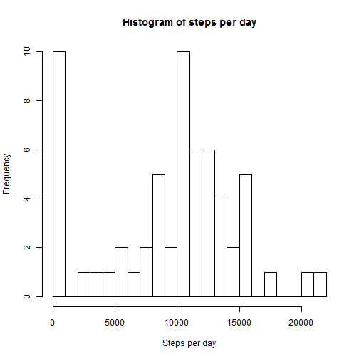
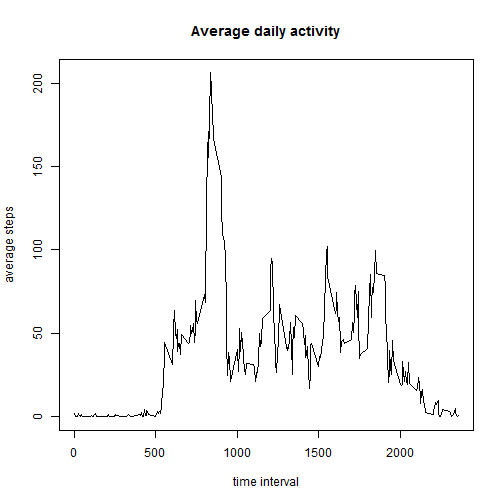
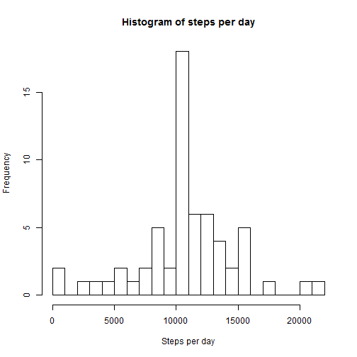
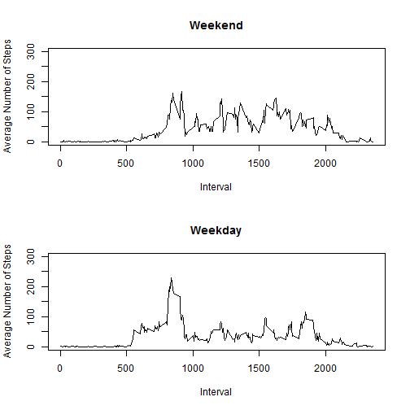

This is an R Markdown document. Markdown is a simple formatting syntax for authoring HTML, PDF, and MS Word documents. For more details on using R Markdown see <http://rmarkdown.rstudio.com>.

When you click the **Knit** button a document will be generated that includes both content as well as the output of any embedded R code chunks within the document. You can embed an R code chunk like this:

###1) First extract the data from .csv data source

```r
dat<-read.csv("activity.csv")
```

###2) Compute the number of steps per day, present histogram and compute mean and median (ignoring "N/As"):


```r
steps_per_day<-tapply(dat$steps,dat$date,"sum",na.rm=TRUE)
hist(steps_per_day,breaks=16,xlab="Steps per day",main="Histogram of steps per day")
```

 

The mean steps per day is:

```r
mean(steps_per_day)
```

```
## [1] 9354.23
```
The median steps per day is:

```r
median(steps_per_day)
```

```
## [1] 10395
```
###3) Compute the average daily activity by time interval and plot it. Display the interval with the max number of steps.

```r
avg_daily_act<-tapply(dat$steps,dat$interval,"mean",na.rm=TRUE)
plot(unique(dat$interval),avg_daily_act,type="l",xlab="time interval",ylab="average steps",main="Average daily activity")
```

 

```r
df<-data.frame(avg_daily_act,unique(dat$interval))
names(df)<-c("avg","interval")
```
what interval had the maximum number of steps?

```r
df[df$avg==max(df$avg),]
```

```
##          avg interval
## 835 206.1698      835
```
###4) Imputing missing values, plotting the histogram of the new data, compute the mean and median of the new dataset.

```r
num_nas= sum(is.na(dat))
repla=numeric(num_nas)
num=1
## Missing values are replaced by the average number of steps computed for that day. We first create a vector "repla" of values to replace the NAs. The values are then passed to newdat (the data with NA replaced)

for (inter in dat$interval[is.na(dat)]){
  repla[num]=df$avg[df$interval==inter]
  num=num+1
}
newdat<-dat
newdat$steps[is.na(newdat$steps)]<-repla


steps_per_day<-tapply(newdat$steps,newdat$date,"sum",na.rm=TRUE)
hist(steps_per_day,breaks=16,xlab="Steps per day",main="Histogram of steps per day")
```

 

The new mean steps per day is:

```r
mean(steps_per_day)
```

```
## [1] 10766.19
```
The new median steps per day is:

```r
median(steps_per_day)
```

```
## [1] 10766.19
```
###5) Are there differences in activity patterns between weekdays and weekends?

```r
## Creating a new factor called "daytype" taking values "weekday" and "weekend" depending on the day type:
newdat<-data.frame(newdat,factor((weekdays(as.Date(newdat$date))=="Saturday" | weekdays(as.Date(newdat$date))=="Sunday"),labels=c("weekday","weekend")))
names(newdat)[4]="daytype"
# Computing the average number of steps by daytype:
new_avg_daily_act<-tapply(newdat$steps,list(newdat$interval,newdat$daytype),"mean",na.rm=TRUE)
dfavg<-data.frame(new_avg_daily_act,unique(newdat$interval))
names(dfavg)[3]="interval"
# Plotting:
par(mfrow=c(2,1))
plot(dfavg$interval,dfavg$weekend,xlab="Interval",ylab="Average Number of Steps",ylim =c(0,300),main="Weekend",type="l")
plot(dfavg$interval,dfavg$weekday,xlab="Interval",ylab="Average Number of Steps",ylim =c(0,300),main="Weekday",type="l")
```

 

The largest peak is seen on weekdays in the morning. It also seems that people have more time to walk during office ours(higher number of steps) over the weekend.

Could it be that people all start to work around the same time and leave the office at different times? This could explain that the peak is present in the morning but less so in the afternoon.
Could it be that people have jobs where they sit in a chair most of the day? Do not forget to workout once in a while Coursera people!
